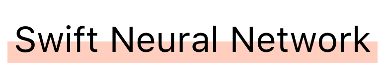

A neural network built in Swift and accelerated by SIMD math. This is a feed forward neural network that can be trained on device with good performance. No need to use a server!

*This is my first foray into machine learning. It is well tested and being used in production, but please file an issue or create a pull request if you see anything wrong or have any questions.*

## Installation
You can add SwiftNeuralNetwork to your project through [Carthage](https://github.com/Carthage/Carthage) by adding the following to your `Cartfile`.

```
github "jasonsilberman/SwiftNeuralNetwork"
```

## Usage
Below is an example of some basic usage, you can look at [/tests](https://github.com/jasonsilberman/SwiftNeuralNetwork/tree/master/Tests) to see some more advanced uses.

### Creation & Training
To get started create an instance of `NeuralNetwork` and train some data to it.

```swift
// This creates a network with three layers of the following sizes(2 nodes, 8, 1).
// The input layer has no activation function, while the second two both use a sigmoid function.
let network = NeuralNetwork(layerStructure: [2, 8, 1], activationFunctions: [.none, .sigmoid, .sigmoid])

// We are going to train our network about the XOR operator.
let trainingData: [[Double]] = [[0, 1], [0, 0], [1, 1], [1, 0]]
let trainingResults: [[Double]] = [[1], [0], [0], [1]]

network.train(inputs: trainingData, targetOutputs: trainingResults, learningRate: 0.9)
```

### Predictions

```swift
let result = network.infer(input: [0, 1])
```

### Cost Calculation
You can calculate the error or cost of the network by using the following function:

```swift
let RSS = network.rss(inputs: trainingData, targetOutputs: trainingResults)
```

## Activation Functions
The following activation functions are available, although some do not work properly yet. You can see the math for them [here](https://github.com/jasonsilberman/SwiftNeuralNetwork/blob/master/SwiftNeuralNetwork/Sources/ActivationFunction.swift).

### None
This should be used on the input layer, it applies no math to the inputs.

### Sigmoid
This is the most common activation function and it will be used most frequently. It will crush all values between `0` and `1`. This function has been tested the most thoroughly.

*NOTE: The inputs to this function should be normalized, otherwise the function will not be that helpful.*

### LeakyReLU
This function only activates if the values are positive. This could be useful if you only want to turn on nodes if a value is positive. This has been somewhat tested.

### Softamx
This function is useful for categorizing data. It is currently a work in progress and not supported.

*NOTE: Do not use this function in production yet.*

## License
This project is licensed under the [MIT License](https://github.com/jasonsilberman/SwiftNeuralNetwork/blob/master/LICENSE).

## Inspiration
All of the following projects helped contribute to my learning and creation of this project. Some of the initial code/concepts were based on them.

- https://ujjwalkarn.me/2016/08/09/quick-intro-neural-networks/
- https://stackoverflow.com/a/43315365/1740273
- https://github.com/Somnibyte/MLKit
- https://github.com/davecom/SwiftSimpleNeuralNetwork
- https://mattmazur.com/2015/03/17/a-step-by-step-backpropagation-example/
- https://machinelearningmastery.com/implement-backpropagation-algorithm-scratch-python/
- https://github.com/jordenhill/Birdbrain
- https://github.com/mattt/Surge
- https://www.analyticsvidhya.com/blog/2017/10/fundamentals-deep-learning-activation-functions-when-to-use-them/
- https://github.com/Kulbear/deep-learning-nano-foundation/wiki/ReLU-and-Softmax-Activation-Functions
- https://github.com/Swift-AI/NeuralNet
